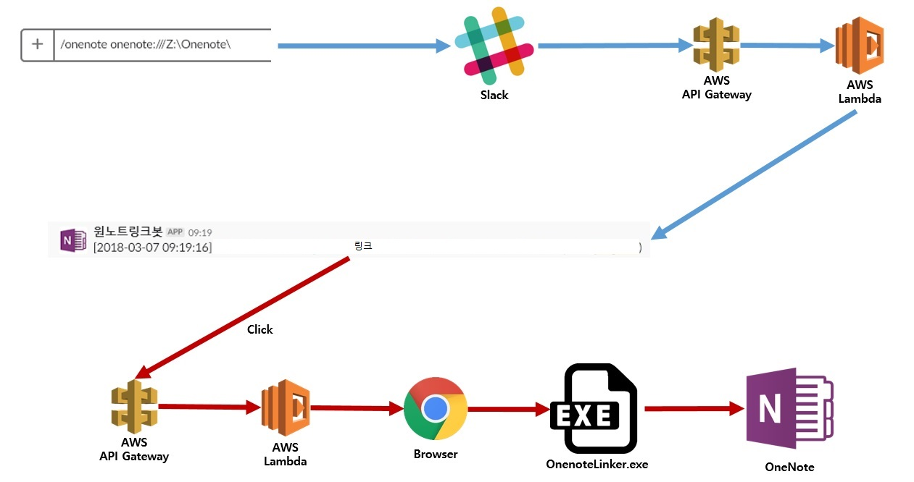

# onenote_in_slack
## 개요
슬랙에서 원노트 링크를 클릭해서 해당 문서에 접근하는 기능
- 슬랙에 원노트 링크를 붙여넣으면 인식하지 못하기 때문에 슬랙 슬래시 명령어와 서버들을 조합해서 구현

## 요소
-	### [Slack Slash Command](https://api.slack.com/slash-commands)
	- #### 슬래시 명령어를 추가할 수 있는 슬랙 권한이 있어야 한다
- ### [OnenoteLinkerLambda](/src/OnenoteLinkerLambda/OnenoteLinkerLambda/README.md)
	- #### AWS Lambda
	- #### AWS ApiGateway 와 연동
	- #### 링크를 만드는 부분과 링크를 실행하는 부분으로 나뉜다
- ### [OnenoteLinker.exe](/src/OnenoteLinker/README.md)
	-	크롬이 onenote:// 경로에 있는 한글 등을 %인코딩해서 원노트로 전달하도록 패치되서 주소를 찾지 못한다
	- OnenoteLinker.exe 를 경유하도록 바꿔서 디코딩한 경로로 바꾼다
		- 레지스트리 등록 필요

## 구조

